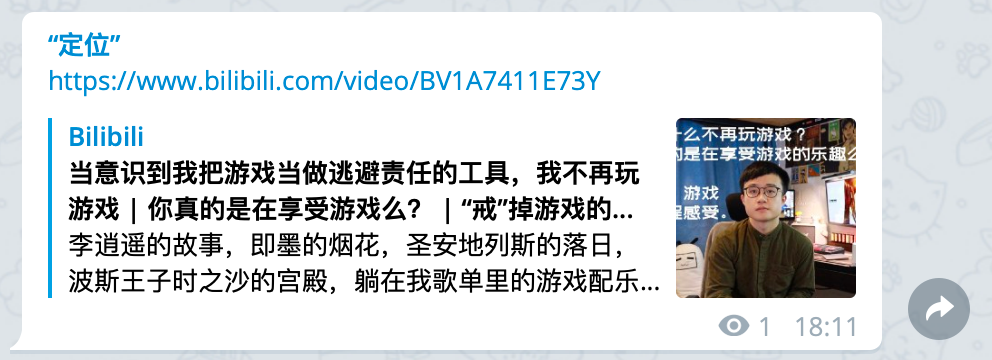
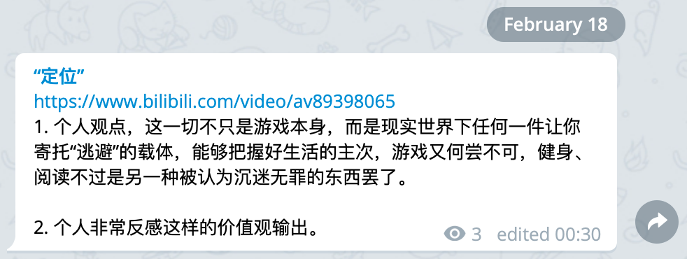

“游戏的内核是娱乐，但当大部分玩家开始攀比、寻找优越感时，自主选择权在不知不觉中被游戏剥夺，玩家最终会成为娱乐的附庸，在好胜心的奴役下更加远离真实的世界和鲜活的人生。” ——[虎嗅](https://www.huxiu.com/article/347284.html?f=wangzhan)

 > Written on April 8, 2020.

## Past
 从小开始，游戏就被家长视作为「数字鸦片」，在不同阶段，不同时期甚至不同场合，告诫我们要「远离游戏」，或许是远离沉迷游戏。不管怎样，游戏成为玩物丧志的载体，而喜欢游戏的人则变成了某种「坏孩子」的榜样。
 于是，我在大学之前，对游戏的概念和记忆是欠缺的。从高中毕业到大学，坚持玩得事件比较久的便是暴雪出品的炉石传说以及Supercell旗下的海岛奇兵。尽管玩的时间最长，但过程是断断续续，时而兴起，时而忘记。

## Present
 时间来到2020，因为疫情的缘故，比较坎坷的入了从2017年就慢慢种草的Nintendo Switch。初到「塞尔达」海拉鲁大地，是惊喜和震撼；「路易吉洋馆3」其实是较早从油管上就种草的作品，之后为了体验类似的游戏模式，还订阅了Arcade玩了「Dead End Job」；再之后陆续因为澳区任亏券的关系，兑换了「任天堂明星大乱斗」和「集合啦！动物森友会」。
 引发我思考的便是2020年3月20号发布的「集合啦！动物森友会」。首先说，游戏制作很精美，模式也不同于以往的养成类游戏，用任天堂自己的定义「沟通、交流」类型，再好不过了。你会为了小动物的某些举动或者言语所感动、会为了穿上一件新衣服而激动，会因为这款游戏与更多的人建立起沟通所欣喜。然后，这一切感觉开始发生变化了，每天完成常规活动，面对大同小异的预设对话，花费了一整个白天和晚上为了「可能的感动」，现在看来真的符合2019年度总结中说的那样，坚守利己主义和实用主义，让自己成为更好的科研工作者。
 我现在的作为是真的再努力变好的作为么？开始怀疑。

## Thoughts
 预定假期末的时候，网络上曾出现这样一个声音：

 而我同时也留下了这样一段话：

 两个月（左右）后的今天，会想起那样的评价，不禁开始反思，那真的理性的思考还是一时游戏的新鲜感冲昏头脑的“有感而发”。是真的在缓解压力而选择游戏，还是为了**放弃奋斗**而游说的借口。

---- 
假期已近4个月的时间，曾许下努力科研的目标现在又付诸了多少“切实”的行动，还在每天作息混乱，每周“胡编乱造”的挤牙膏式工作汇报，这样下去**一定**会是没有未来的下场。
游戏也许可以作为交流的载体，精神的寄托，但不应成为人生（日常）目标，至少不是个人目标主业。