# 一、常见issues
## 1. Python｜Python3、pip｜pip3
> https://blog.csdn.net/qq_39039017/article/details/79889521
<!-- > [DEVONarchive] x-devonthink-item://820BDD7B-5D78-4866-9DDF-8294D2BFC65D -->
    # python
    sudo apt-get install python
    sudo apt-get install python-pip
    ## 解决Ubuntu20下无法locate pip问题
            1. sudo apt-get purge python-pip
            2. wget https://bootstrap.pypa.io/get-pip.py
            3. sudo python get-pip.py
            4. pip --version
            5. 
    
    # python3
    sudo apt-get install python3
    sudo apt-get install python3-pip
    


## 2. pip install memory error
    pip install package-name --no-cache-dir


## 3. ignore warnings
    
    import warnings
    warnings.filterwarnings("ignore")


## 4. cp 拷贝文件
    https://man.linuxde.net/cp


## 5. release mem
    free -m
    sync(sync data/status)
    echo 0/1/2/3 > /proc/sys/vm/drop_caches
    0：不释放（系统默认值）
    1：释放页缓存
    2：释放dentries和inodes
    3：释放所有缓存

## 6. 修改文件（夹）权限
    chmod -R 777 directory_path #-R表示递归目录下所有文件；777表示所有读写权限


## 7. 移除文件
    rm -rf directory_path


## 8. 定位cuda
    cd usr/local
    stat cuda


## 9. 定位文件
    locate filename


## 10. ubuntu 死机重启
    Alt+SysRq+reisub


## 11. make覆盖失败
    make clean


## 12. uninstall application
    dpkg --list
    sudo apt-get --purge remove 包名（--purge是可选项，写上这个属性是将软件及其配置文件一并删除，如不需要删除配置文件，可执行sudo apt-get remove 包名）


## 13. 更改源之后出现 sudo: apt-get: command not found 问题解决
> https://www.jianshu.com/p/e878ddf068f0
    wget http://ftp.cn.debian.org/debian/pool/main/a/apt/apt_1.4.9_amd64.deb
    dpkg -i apt_1.4.9_amd64.deb


## 14. *安装使用electron-ssr (Surge EnhanceMode)
- 安装环境
    ```
    # 安装依赖
    sudo apt install libcanberra-gtk-module libcanberra-gtk3-module gconf2 gconf-service libappindicator1
    
    # 检查并安装python
    which python
    ```
- Proxy config
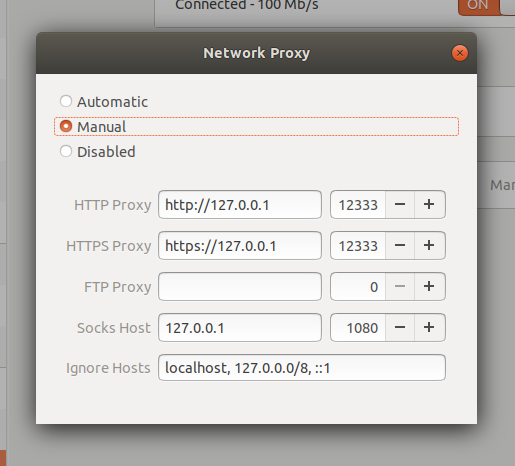
    ```
    http://127.0.0.1
    https://127.0.0.1
    12333
    ```
- 参考
> https://github.com/qingshuisiyuan/electron-ssr-backup
> https://github.com/qingshuisiyuan/electron-ssr-backup/blob/master/Ubuntu.md


## 15. Linux 快速格式化


## 16. git clone 出现 Could not resolve proxy: https
    git config --global --unset http.proxy
    git config --global --unset https.proxy


## 17. Tensorflow 运行警告提示 Your CPU supports instructions that this TensorFlow binary was not compiled to use
> https://www.cnblogs.com/devilmaycry812839668/p/8987223.html
> https://github.com/lakshayg/tensorflow-build


## 18. 安装 Google Chrome
    wget https://dl.google.com/linux/direct/google-chrome-stable_current_amd64.deb
    sudo dpkg -i google-chrome-stable_current_amd64.deb
    
    #dpkg: error: dpkg status database is locked by another process
    sudo rm /var/lib/dpkg/lock
    sudo dpkg --configure -a
> https://itsfoss.com/install-chrome-ubuntu/#install-chrome-terminal
> https://askubuntu.com/questions/219545/dpkg-error-dpkg-status-database-is-locked-by-another-process


## 19. 搜狗输入法
> https://blog.csdn.net/lupengCSDN/article/details/80279177
<!-- > [DEVONarchive] x-devonthink-item://3477BAF6-4EBE-4F4D-AADA-0AAF9866003D -->


## 20. su
    sudo passwd root #reset pwd


## 21. opendr
> https://github.com/mattloper/opendr/wiki/Installation-in-Ubuntu

或直接指定要求版本号


## 22. HiDPI
> http://tresdev.blogspot.com/2019/02/hidpi-ubuntu-1804-parallels.html


## 23. ubuntu 安装chumpy
> https://blog.csdn.net/qq_41381865/article/details/105983439


## 24. Output Mesh
> https://pymesh.readthedocs.io/en/latest/basic.html#saving-mesh


## 25. pip install XXX：encounter error
    pip3 install -U pip


## 26. zsh
[Customize your terminal (Oh My Zsh) on Ubuntu 18.04 LTS](https://medium.com/@thecaffeinedev/customize-your-terminal-oh-my-zsh-on-ubuntu-18-04-lts-a9b11b63f2)

    sudo apt-get update
    sudo apt upgrade
    sudo apt install zsh
    sudo apt-get install powerline fonts-powerline
    git clone https://github.com/robbyrussell/oh-my-zsh.git ~/.oh-my-zsh

    #附加
    cp ~/.oh-my-zsh/templates/zshrc.zsh-template ~/.zshrc
    git clone https://github.com/bhilburn/powerlevel9k.git ~/.oh-my-zsh/custom/themes/powerlevel9k
    gedit .zshrc #gedit command

    #切换shell
    chsh -s /bin/zsh

> chsh 切换不生效：https://askubuntu.com/questions/195361/chsh-s-usr-bin-zsh-not-working


## 27. virtualenv
> http://www.cnscarb.com/blog/post/344.html

    sudo apt-get install virtualenv #or pip install virtualenv
    cd ./Projects
    virtualenv venv_project #using .name to hide folder
    #using "--python=/usr/bin/python3" existing python lcoal env[Path Check] to create a virtualenv
    source venv_project/bin/activate
    pip install -U pip #[Optional_1] update pip
    deactivate #quit venv
    source venv_project/bin/activate #[Optional_2]
    pip install -r requirements.txt
    
    #removing venv_project folder to delete virtualenv

## 28. 使用拖动操作拷贝文件到系统文件夹内权限问题
    运行 sudo nautilus, 自动打开窗口，可直接在这个窗口中移动或拷贝文件

# 二、深度学习环境配置
## 0. 快捷键Tips

- 使用 “shift+ctrl+v” 直接在控制台粘贴
- 使用 “alt+ctrl+t“ 打开Terminal 控制台
- 使用 ”ctrl+h“ 显示隐藏文件


## 1. CUDA 10.0 及 cuDNN安装
> 参考1：https://blog.csdn.net/qq_32408773/article/details/84112166
> 参考2：https://zhuanlan.zhihu.com/p/47330858

**0. 准备**

- **禁用 nouveau驱动**，很多文章中提到需要禁用该驱动，提供的方法都是命令行，尝试过后较为繁琐，且失败几率较大，下面采用可视化修改系统设置的方式禁用 nouveau驱动
- 打开“Software & Updates”
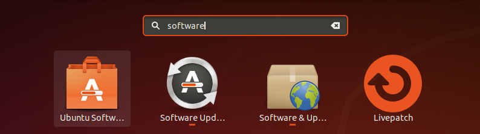

- 打开“Additional Drivers”，选择“nvidia-driver-xxx”，即可**禁用nouveau驱动**，后面版本号建议选择最新
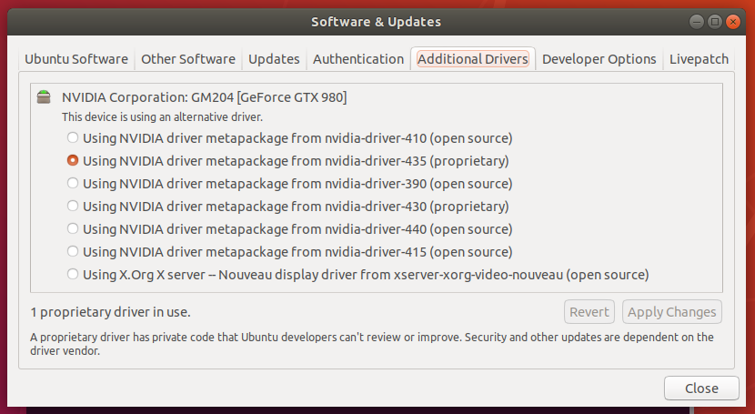


**1. CUDA10.0 安装**

- 下载 CUDA 10.0 安装文件
> https://developer.nvidia.com/cuda-10.0-download-archive?target_os=Linux
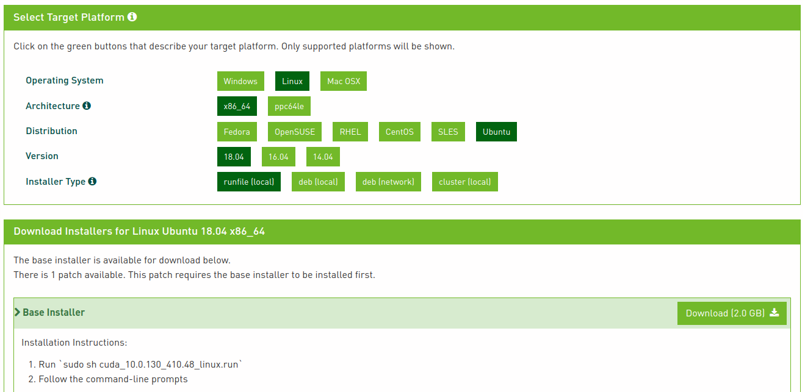

- 下载 runfile 格式安装文件，打开下载目录，右键“Open in Terminal”，并运行“sudo sh cuda_10.0.130_410.48_linux.run”
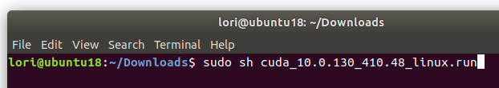

- 等待出现下列提示，可使用 “ctrl+c” 直接跳过
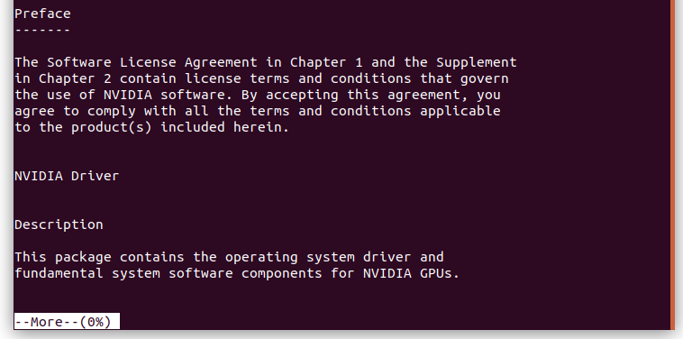

- 根据给出的选项，进行输入，一般来都选择accpet/yes
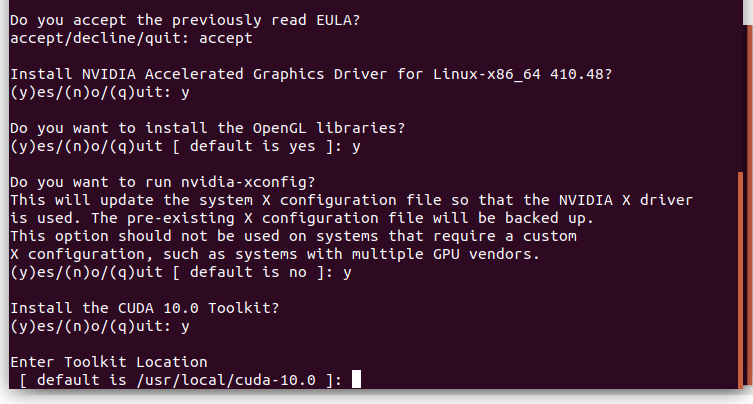

- 最后出现 successfully表明安装成功；若失败，可能是路径未自动配置，打开home文件夹下的“./bashrc” 文件，在末尾添加如下命令
    ```
    export PATH=/usr/local/cuda-10.0/bin${PATH:+:$PATH}}
    export LD_LIBRARY_PATH=/usr/local/cuda-10.0/lib64${LD_LIBRARY_PATH:+:${LD_LIBRARY_PATH}}
    ```
- 下面使用两种方法进行验证
- （方法一）运行“nvcc -V”, 显示如下即表明安装成功
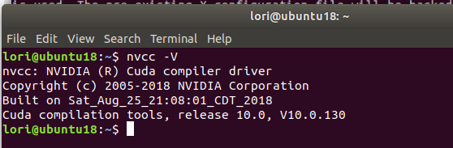

> 若提示安装 nvidia-toolkit 工具，根据提示的方法进行安装，完成后再进行上一步验证即可
- （方法二）运行安装过程中添加的samples进行测试
    ```
    1. cd /usr/local/cuda/samples/1_Utilities/deviceQuery //打开samples实例
    2. sudo make //如果已经存在“.o”文件，可以使用“make clean”进行清理，如果提示权限受限，可以使用“sudo nautilus”方式打开文件后再进行测试
    ```
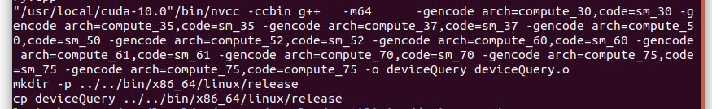

```
3. /deviceQuery
```

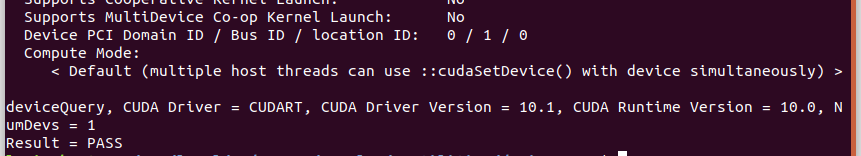


**2. cuDNN 安装 （需注册 nvidia 账号）**

> https://developer.nvidia.com/rdp/form/cudnn-download-survey
- 根据安装的cuda版本下载对应的cuDNN版本文件
- 下载完成后解压并进入文件夹（此处见参考1，主要是将文件拷贝到对应的文件夹）
```
    1. sudo cp cuda/include/cudnn.h /usr/local/cuda/include/ 
    2. sudo cp cuda/lib64/libcudnn* /usr/local/cuda/lib64/ 
    3. sudo chmod a+r /usr/local/cuda/include/cudnn.h 
    4. sudo chmod a+r /usr/local/cuda/lib64/libcudnn*
```
- 在终端查看CUDNN版本
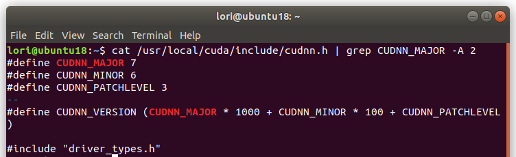


## 2. PyTorch安装
> https://pytorch.org/get-started/locally/

**1. 安装 python，pip工具**

> 参考3：https://blog.csdn.net/HevenYin/article/details/69386041
    sudo apt-get install python-pip
    sudo apt-get install python3-pip
    //安装完成后可以使用pip -V和pip3 -V查看看装的pip版本。
    在使用pip安装其他库时，默认的python版本可以直接使用pip install XXXX
    另外的python版本可以使用python3 -m pip install XXXX 或pip3 install XXXX

**2. 安装最新版本，使用官网提供的方式**

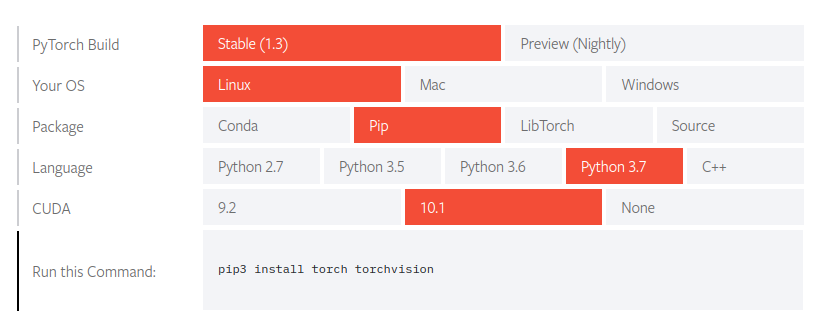


**3. 安装旧版本，选择cuda对应的版本下载**

> https://pytorch.org/get-started/previous-versions/
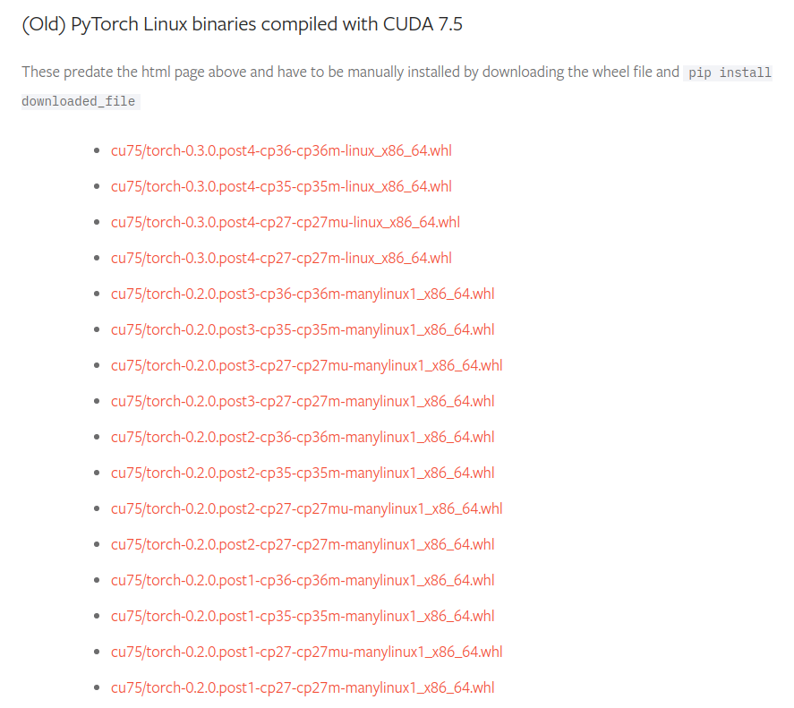


**4. 使用 “pip install downloaded_file” 进行安装，直至安装完毕**

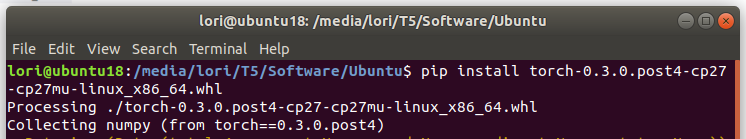

> 若出现失败提示，则需要更换不同cp版本再进行安装


## 3. Demo:CMR 环境配置
> https://github.com/akanazawa/cmr

**1. 环境要求**

- Python 2.7
- PyTorch tested on version 0.3.0.post4

**2. 安装依赖库(pip install)**

> 依据代码文件夹中requirements.txt给出的依赖库进行安装

    absl-py==0.1.10
    chainer==3.3.0
    cupy==2.3.0
    Cython==0.27.3
    h5py==2.7.1
    imageio==2.2.0
    ipdb==0.10.3
    matplotlib==2.1.2
    meshzoo==0.3.1
    numpy==1.14.0 #程序对该库依赖性很强，务必安装该版本
    opencv-python==3.4.0.12
    Pillow==5.0.0
    progressbar==2.3
    protobuf==3.5.1
    PyOpenGL==3.1.0
    scikit-image==0.13.1
    scipy==1.0.0
    torchfile==0.1.0
    torchvision==0.2.0
    tqdm==4.19.5
    visdom==0.1.7


**3. 安装 Neural Mesh Renderer and Perceptual loss**

- 打开cmr文件夹，使用以下命令安装依赖文件
    cd external;
    bash install_external.sh

**4. 下载训练模型、数据集**

- 训练模型
    wget https://people.eecs.berkeley.edu/~kanazawa/cachedir/cmr/model.tar.gz & tar -vzxf model.tar.gz
- 数据集
    wget http://www.vision.caltech.edu/visipedia-data/CUB-200-2011/CUB_200_2011.tgz && tar -xf CUB_200_2011.tgz

**5. 运行demo、训练（PyCharm运行）**

- demo（demo.py）
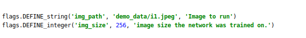

- 训练模型（shape.py）
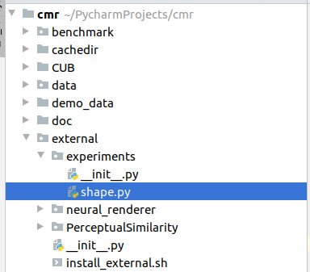
